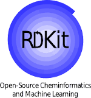

# 🧪 02 — SMILES & Cheminformatics with RDKit



Introduction to molecular representations and cheminformatics for A-level students,
using Python and the open-source **RDKit** library.

---

## 📁 Folder Contents

| File | Type | Description |
|------|------|-------------|
| `smiles_tutorial.ipynb` | Notebook | Main tutorial |
| `smiles_exercises.ipynb` | Notebook | Practice exercises |
| `FDA_smiles.csv` | Data | Dataset of FDA-approved drug SMILES strings |
| `fda.sdf` | Data | FDA drug structures in SDF format |
| `acetic.sdf` | Data | Acetic acid structure in SDF format |
| `branch1.png` | Image | SMILES branching diagram |
| `nested.png` | Image | Nested branches example |
| `rings.png` | Image | Ring encoding diagram |
| `rings2.png` | Image | Ring encoding — alternative representations |
| `pyridine.png` | Image | Pyridine structure |
| `smiles_v1.png` | Image | SMILES examples table |
| `tanimoto.png` | Image | Tanimoto similarity diagram |
| `E_VS_Z.png` | Image | E/Z stereoisomer SMILES notation |
| `anti.png` | Image | Stereochemistry diagram |

> ⚠️ Keep all files in the same folder as the notebooks — the notebooks load
> the images and data files by filename from the working directory.

---

## 📖 What You Will Learn

### Part 1 — SMILES Notation
SMILES (Simplified Molecular-Input Line-Entry System) is a way of writing a
molecule as a text string. For example:

| Molecule | SMILES |
|----------|--------|
| Water | `O` |
| Ethanol | `CCO` |
| Aspirin | `CC(=O)Oc1ccccc1C(=O)O` |
| Caffeine | `CN1C=NC2=C1C(=O)N(C(=O)N2C)C` |

The five core rules covered in the tutorial:
1. **Atoms** — element symbols; organic subset atoms need no brackets
2. **Bonds** — single bonds implicit; `=` double; `#` triple
3. **Branches** — enclosed in round brackets `(...)`; can be nested
4. **Rings** — broken bond labelled with matching numbers at both ends
5. **Stereochemistry** — `/` and `\` for E/Z isomers; `@` for chirality

### Part 2 — RDKit
**RDKit** is an open-source cheminformatics toolkit used across academia and
the pharmaceutical industry. In this tutorial it is used to:
- Convert SMILES strings into molecule objects
- Draw 2D molecular structures
- Calculate molecular descriptors

### Part 3 — Molecular Properties & Lipinski's Rule of Five
Lipinski's Rule of Five is used in drug discovery to assess whether a compound
is likely to be orally bioavailable:

| Property | Limit |
|----------|-------|
| Molecular weight | ≤ 500 Da |
| H-bond donors | ≤ 5 |
| H-bond acceptors | ≤ 10 |
| Topological polar surface area (TPSA) | < 140 Ų |

### Part 4 — Molecular Similarity & Tanimoto Coefficient
Molecules are encoded as binary **fingerprints** — vectors of 0s and 1s
representing the presence or absence of chemical fragments. The
**Tanimoto coefficient** measures the overlap between two fingerprints:

$$T = \frac{A}{A + B + C}$$

where $A$ = bits set in both, $B$ = bits only in molecule 1,
$C$ = bits only in molecule 2. The coefficient ranges from 0 (no similarity)
to 1 (identical).

---

## 🗂️ Notebooks

### `smiles_tutorial.ipynb` — Main Tutorial

| Section | Content |
|---------|---------|
| 0 | Installing RDKit and DeepChem |
| 1 | SMILES notation and the five rules |
| 2 | Importing RDKit modules |
| 3 | Drawing molecules with `MolFromSmiles` and `MolToImage` |
| 4 | Canonical SMILES |
| 5 | Calculating molecular properties; Lipinski filter on FDA dataset |
| 6 | Molecular fingerprints and Tanimoto similarity; imatinib vs nilotinib |

### `smiles_exercises.ipynb` — Practice Exercises

| Exercise | Topic | Difficulty |
|----------|-------|------------|
| 1 | Writing SMILES from scratch | ⭐ |
| 2 | Reading SMILES — identify the molecule | ⭐ |
| 3 | Drawing common medicines | ⭐ |
| 4 | Rings and aromaticity | ⭐⭐ |
| 5 | Build a molecular property calculator function | ⭐⭐ |
| 6 | Lipinski filter on a mixed compound dataset | ⭐⭐ |
| 7 | Similarity search — rank compounds against a reference | ⭐⭐⭐ |
| 8 | Mystery molecule challenge | ⭐⭐⭐ |
| Bonus | Design your own drug-like molecule | 🌟 |

Each exercise includes a 💡 hint and ✅ solution (collapsed by default).

---

## ⚙️ Requirements

```bash
pip install rdkit deepchem pandas matplotlib
```

---

## 🎓 Context

These notebooks were developed for the **AI Literacy Project** taster day
workshops at **Queen Mary University of London**, Department of Chemistry.
They are designed for A-level students with no prior Python experience.

Taster day participants will leave able to:
- Read and write SMILES strings for real molecules
- Use Python to draw and analyse molecular structures
- Understand how computational tools accelerate drug discovery
- Appreciate the role of AI and machine learning in modern chemistry

---

## 📚 Further Reading

- [SMILES theory](https://www.daylight.com/dayhtml/doc/theory/theory.smiles.html)
- [RDKit documentation](https://www.rdkit.org/docs/GettingStartedInPython.html)
- [RDKit blog](https://greglandrum.github.io/rdkit-blog/)
- [PubChem](https://pubchem.ncbi.nlm.nih.gov/) — search any molecule by name to find its SMILES
- Weininger, D. *J. Chem. Inf. Comput. Sci.*, 1988, **28**, 31
  ([DOI: 10.1021/ci00057a005](https://doi.org/10.1021/ci00057a005))
